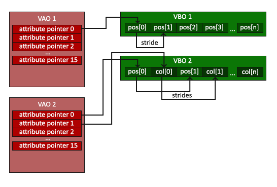

# PEMROGRAMAN GAME

### **Game engine**
> software yang dapat dikembangkan dan digunakan untuk sebagai dasar pengembangan game lainnya tanpa banyak modifikasi. - *Jason Gregory* 

berikut adalah perkembangan game engine:
- hanya dapat digunakan untuk satu aplikasi saja.
- dapat dikembangkan untuk beberapa game serupa
- dapat digunakan untuk mengembangkan game secara spesifik dalam satu genre


### **Game Loop**

user input -> network -> game logic -> sound -> rendering.

### **Pseudo Code Game Loop**

```c++
TargetFrametime = 1000 / targetFramerate
while game is running
    realDeltaTime = time since last frame	
    gameDeltaTime = realDeltaTime * gameTimeFactor	
    foreach Updateable o in GameWorld.updateableObjects	
        o.Update(gameDeltaTime)
    loop	
        foreach Drawable o in GameWorld.drawableObjects	o.Draw()
    loop	
        while (time spent this frame) < targetFrameTime 
    loop
loop 
```


# MATH FOR GAME

### **Vector**
#### penambahan:
>jika vektor berlawanan (**a** berlawanan dengan **b**) kemudian mencari resultan (garis tengah, **c**).
```
c = a + b = (ax + bx, ay + by, az + bz)
```


#### pengurangan:
>jika vektor berlawanan (**a** berlawanan dengan **b**) kemudian mencari jarak (garis **a** ke **b** yaitu **c**).
```
c = b - a = (bx -ax, by - ay, az -bz) 
```


#### panjang vektor:
```
||a|| = akar(ax2 + ay2 + az2)
```

#### perkalian skalar:
```
s.a = (s.ax, s.ay, s.az)
```

#### dot product
- ***dot product digunakan untuk mencari panjang atau sudut***.
- hasil dari dot product adalah angka.

untuk mencari hasil perkalian dot. kita bisa menggunakan 2 cara
yang pertama dengan perkalian dot tiap komponen (x,y,z)

```
a.b = ax.bx + ay.by + az.bz
```
atau bisa juga dengan perkalian sudut.
alpha adalah sudut antara vector a dan b.
```
a.b = ||a||.||b||.cos(alpha)
```

#### cross product
- dot product digunakan untuk mencari vector ketiga. misal ada vector a dan b, hasil dari cross product adalah vector c.
- hasil dari cross product adalah vector lain.
- cross product menggunakan ***kaidah tangan kanan***
- posisi vector a dan b mempengaruhi hasil (vector c) positif atau negatif nya.


# GAME GRAPHIC PT. 1

***openGL mentransformasi data 3D menjadi 2D***. karena monitor/layar kita menerima data 2D.

proses transformasi diatur oleh Graphic Pipeline. graphic pipeline mentransform 3D -> 2D, kemudian 2D -> Color pixel.

alur dari pipeline.
- Vertex shader 
- shape assembly
- geometry shader
- rasterization
- fragment shader
- test and blending

openGL modern setidaknya memiliki ***Vertex Shader*** dan ***Fragment Shader***

### **Vertex Data**
vertex merupakan kumpulan dari vertices. atau kumpulan dari data setiap koordinat 3D

openGL menggunakan 3D coordinate (x, y, dan z). masing masing menggunkan nilai dengan rentang

>-1.0 -> 1.0\
>disebut juga dengan\
>**Normalized Device Coordinate (NDC)**

kode dibawah menghasilkan Segitiga.
```C++
float vertices[] = {
    // X     Y      Z
    -0.5f,  -0.5f,  0.0f,
     0.5f,  -0.5f,  0.0f,
     0.0f,   0.5f,  0.0f
}; 
```


### **Shader In/Out**
dalam graphic pipeline, output dari setiap stage dibutuhkan untuk stage berikutnya. misalkan output dari ***vertex shader*** menjadi input dari ***fragment shader***.

seperti yang telah dideskripsikan sebelumnya (Graphic pipeline). hanya tiga komponen saja yang dapat kita inject shader. yaitu ***vertex***, ***geometry***, dan ***fragment shader***.

dengan syarat nama dan tipe harus sama. misal:
```C
//Vertex shader
#version 330 core
layout (location = 0) in vec3 aPos; 

out vec4 vertexColor; // specify a color output to the fragment shader

void main()
{
    gl_Position = vec4(aPos, 1.0); 
    vertexColor = vec4(0.5, 0.0, 0.0, 1.0); 
}
```

variable vertexColor menjadi input di fragment shader:

```C
#version 330 core
out vec4 FragColor;
  
in vec4 vertexColor; // the input variable from the vertex shader (same name and same type)  

void main()
{
    FragColor = vertexColor;
} 
```

### **Uniform**
cara lain passing data dari aplikasi (CPU) ke shaders (GPU) adalah menggunakan uniform. ***uniform bersifat global dan dapat diakses pada stage apapun dalam graphic pipeline***.

berikut contoh deklarasi Uniform type pada fragment shader:
```C
#version 330 core
out vec4 FragColor;
  
uniform vec4 ourColor; // Uniform type

void main()
{
    FragColor = ourColor;
}   
```

kemudian kita dapat memanggil uniform dan mengupdatenya:

```C 
float timeValue = glfwGetTime();
float greenValue = sin(timeValue) / 2.0f + 0.5f;
int vertexColorLocation = glGetUniformLocation(shaderProgram, "ourColor");
glUniform4f(vertexColorLocation, 0.0f, greenValue, 0.0f, 1.0f);
```

### **Location**
jika kita ingin menambahkan data warna kedalam vertex, kita perlu menentukan lokasi tiap data, posisi atau warna.

menambahkan warna kedalam vertex:
```C
float vertices[] = {
    // posisi            // warna
     0.5f, -0.5f, 0.0f,  1.0f, 0.0f, 0.0f,   // bottom right
    -0.5f, -0.5f, 0.0f,  0.0f, 1.0f, 0.0f,   // bottom left
     0.0f,  0.5f, 0.0f,  0.0f, 0.0f, 1.0f    // top 
};    
```

untuk mengambil data tiap tipe dalam vertex kita menggunakan fungsi ***Location***:
```C
#version 330 core
layout (location = 0) in vec3 aPos;   
//posisi memiliki indeks = 0
layout (location = 1) in vec3 aColor; 
//sedangkan warna memiliki indeks 1

out vec3 ourColor; 

void main(){}   
```

## **VAO, VBO, EBO**
### **VBO**

tempat dimana kita menyimpan banyak data vertex. format data dari vertex buffer sebagai berikut:


- setiap posisi data disimpan 32-bit
- setiap vertex terdiri dari 3 posisi. x, y, z.

gambar diatas adalah representasi saat hanya ada satu vertex dalam array. misalkan saat kita hanya mendeklarasikan posisi segitiga dalam vertex.
```C++
float vertices[] = {
    // X     Y      Z
    -0.5f,  -0.5f,  0.0f,
     0.5f,  -0.5f,  0.0f,
     0.0f,   0.5f,  0.0f
}; 
```

namun setelah ditambahkan array warna. menjadi seperti berikut:
```C
float vertices[] = {
    // posisi            // warna
     0.5f, -0.5f, 0.0f,  1.0f, 0.0f, 0.0f,   // bottom right
    -0.5f, -0.5f, 0.0f,  0.0f, 1.0f, 0.0f,   // bottom left
     0.0f,  0.5f, 0.0f,  0.0f, 0.0f, 1.0f    // top 
};    
```


### **VAO**
vertex array object berisi
- Calls to glEnableVertexAttribArray or glDisableVertexAttribArray.
- Vertex attribute configurations via glVertexAttribPointer.
- Vertex buffer objects associated with vertex attributes by calls to glVertexAttribPointer

VAO berisi pointer ke VBO. dengan cara memanggil ke VBO. VAO juga berisi EBO

contoh VAO adalah pointer ke Array dalam vertex seperti **Posisi** atau **Warna**.


### **EBO**
Element Buffer Object. merupakan pointer pada VAO.

untuk lebih mudah memahami bisa dilihat penjelasan berikut.
misalkan kita ingin menggambar sebuah persegi yang terdiri dari dua buah segitiga.


dalam vertex nya kita dapat menuliskan kode sebagai berikut:
```C
float vertices[] = {
    // first triangle
     0.5f,  0.5f, 0.0f,  // top right
     0.5f, -0.5f, 0.0f,  // bottom right
    -0.5f,  0.5f, 0.0f,  // top left 
    // second triangle
     0.5f, -0.5f, 0.0f,  // bottom right
    -0.5f, -0.5f, 0.0f,  // bottom left
    -0.5f,  0.5f, 0.0f   // top left
}; 
```
terjadi redundancy dalam kode tersebut. kita mendeklarasikan bottomRight dan topLeft dua kali. untuk menghemat penggunaan memori kita dapat menghapus element yang sama dan menggunakan pointer untuk menggambar segitiga. inilah fungsi dari **EBO**

```C
float vertices[] = {
     0.5f,  0.5f, 0.0f,  // top right
     0.5f, -0.5f, 0.0f,  // bottom right
    -0.5f, -0.5f, 0.0f,  // bottom left
    -0.5f,  0.5f, 0.0f   // top left 
};
unsigned int indices[] = {  // note that we start from 0!
    0, 1, 3,   // first triangle
    1, 2, 3    // second triangle
};  
```
kita menggunakan array ***indices*** sebagai pointer. 0,1,2 untuk segitiga pertama. 1,2,3 untuk segitiga kedua.

gambaran VBO, VAO dan EBO


## **Texture**
untuk menambahkan tekstur kita langsung menambahkan array kedalam array vertex. hanya 2 koordinat yang berupa X dan Y.

```C
float vertices[] = {
    //posisi              //warna             //tekstur
     0.5f,  0.5f, 0.0f,   1.0f, 0.0f, 0.0f,   1.0f, 1.0f,   
     0.5f, -0.5f, 0.0f,   0.0f, 1.0f, 0.0f,   1.0f, 0.0f,   
    -0.5f, -0.5f, 0.0f,   0.0f, 0.0f, 1.0f,   0.0f, 0.0f,   
    -0.5f,  0.5f, 0.0f,   1.0f, 1.0f, 0.0f,   0.0f, 1.0f    
};
```

karena kita menambahkan atribut vertex baru (tekstur) maka VBO terlihat seprti berikut


# **GAME GRAPHIC PT.3**
part 2 skip. karena dikit.
part 3 berisi soal transformasi, trasnlasi, scaling.

>Dalam OpenGL kita melakukan secara terbalik/reversed dengan apa yang kita inginkan.

>Dalam OpenGl urutan operasi (transform, scale, rotate) mempengaruhi hasil.

`rotasi -> translasi`
berbeda dengan 
`translasi -> rotasi`


translasi, transform, scaling. di learnOpenGL.