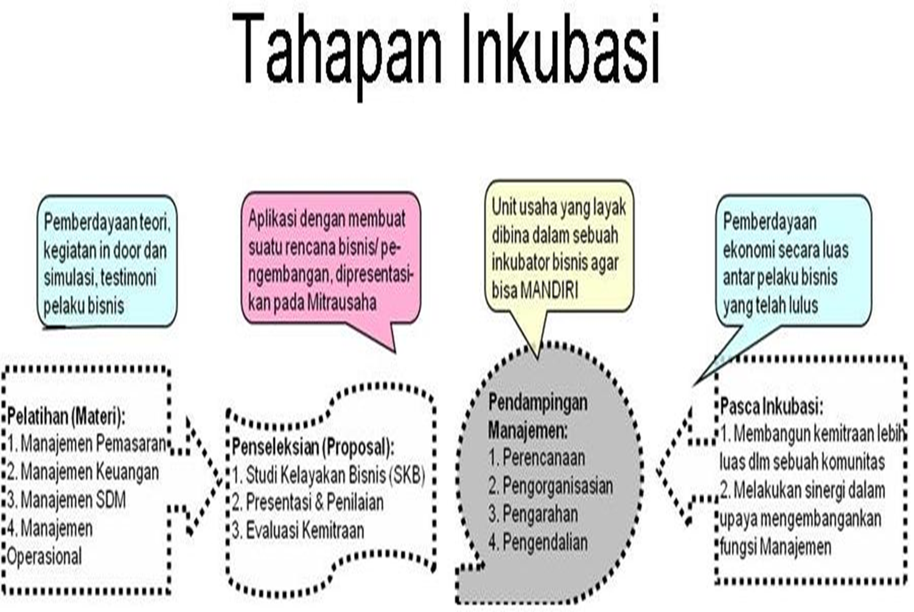

# **KEWIRAUSAHAAN**

## **BAB. II - TECHNOPRENEURSHIP**

#### KEWIRAUSAHAAN DAN PEMBANGUNAN EKONOMI

1. _Perindustrian negara dipengaruhi oleh tingkat perkembangan kewirausahaan._
2. negara terbelakan bisa terjadi karena kekurangan jumlah wirausaha.
3. secara historis, kewirausahaan mampu merubah arah ekonomi.

---

#### KEWIRAUSAHAAN MENURUT PAKAR

##### AKHORI

- kewirausahaan berdampak pada **_peningkatan lapangan kerja_**, pendapatan **_perkapita_**, pertumbuhan **_ekonomi_**.
- kunci penting dalam pembangunan suatu wilayah.
- pada komputer, terjadi **_perbaikan iteratif_** terhadap kecepatan, fungsi dan ukuran.
- mendorong pengembangan perangkat lunak.

##### CUERVO, RIBEIRO, DAN ROIG

- kewirausahaan merupakan faktor penting dalam ekonomi. dengan cara **evaluasi peluang usaha**, **menciptakan usaha**, **menggerakkan ekonomi**.
- mempengaruhi semua bidang organisasi.

---

#### MANFAAT DALAM PEMBANGUNAN

1. pertumbuhan ekonomi
2. peningkata produktivitas nasional
3. pengembangan teknologi
4. pengembangan pasar

---

#### RINCIAN PERAN WIRAUSAHA

1. mengurangi pengangguran
2. pemantik pembangunan di segala bidang
3. memberi bantuan kepada sekitar
4. mendidik karyawan, membentuk kompetensi
5. sebgai contoh pada orang lain
6. hidup efisien

---

#### PENGEMBANGAN KEWIRAUSAHAAN DI INDONESIA

> secara sistematis, kewirausahaan dikembangkan pada tahun 1995 dengan **_instruksi presiden RI No 4 tahun 1995. oleh Soeharto_**.

Instruksi presiden memberi arahan pada **_17 menteri_**, **_Gubernur BI_** dan para **_Gubernur daerah untuk_**:

1. menggalakan kewirausahaan pada sektor masing-masing.
2. koordinasi oleh menteri koperasi dan pembinaan usaha kecil.
3. dengan tujuan **_meningkatkan kesadaran_**, **_jumlah wirausaha_**, **_kemampuan wirausaha_**.
4. ruang linkup pada program **_kelembagaan_**, **_budaya_**, dan **_mayarakat_**.
5. pembinaan pra-pengusaha (6 department)
6. pembinaan kelompok usaha kecil.

---

#### KEWIRAUSAHAAN DI AMERIKA SERIKAT

1. di Amerika terjadi penurunan pembangunan dikarenakan kalah bersaing dalam bidang otomotif, elektronik dari negara jepang pada tahun 1980an.
2. Amerika kurang inovatif dan produktif. sehingga cost effectiveness dan mutu kalah saing.
3. dilakukan penerapan dan pengembangan kewirausahaan dan inkubator bisnis dalm menciptakan korporat science.
4. sebagai hasil dari upaya, terjadi ledakan besar wirausahawan baru di bidang teknologi.
5. 1999 MIT menerapkan: Eneterprenuerial Univ.

---

#### PERAN INKUBATOR BISNIS

1. Inkubator Bisnis
   > intitusi yang dirancang untuk pertumbuhan dan menjamin keberhsilan wirausaha.
2. Gagasan Inkubator
   > karena hanya 20% perusahaan baru yang survive.
3. Para pakar ekonom percaya bahwa inkubator cukup efektif
4. 2006 inkubator bisnis meciptakan 40.000 lapangan kerja di eropa
5. inkubator bsini menguatkan wirausaha baru.
6. umumnya terdapat diperguruan tinggi atau instansi pemerintah yang membina UKM.
7. inkubator di indonesia: UI, ITB, Bakrim ITS, Unsoed.
8. pertamakali di IPB tahun 1993.
9. pelayanan inkubator:
   - sewa tempat murah
   - fasilitas bersama
   - pelayanan
   - akses pembiayaan
   - dukungan moral, psikolog, teknologi.

---

#### PROGRAM INKUBATOR

1. Bimbingan teknis
2. Membangun kemitraan, Promosi produk
3. Pendampingan UKM
4. Operasional manajemen

Tahapan Inkubasi:

