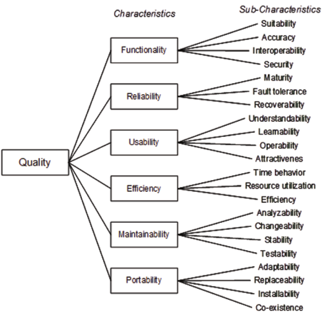
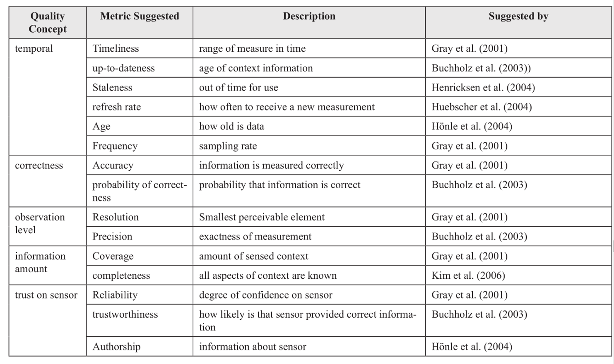

# **REKAYASA PERANGKAT APLIKASI BERGERAK**

## **CH. IV. REQUIREMENT AND QUALITY**

#### **TANTANGAN**

pengembangan mobile sangat `susah dan rawan error`. karenna:

- keterbatasan hardware
- resources yang variatif
- kondisi yang tidak stabil
- isu privasi dan keamanan

---

#### ANALISIS KEBUTUHAN

dan spesifikasi aktivitas merupakan `faktor` untuk sukses dalam pengembangan.

kebutuhan merupakan koneksi antara keinginan pengguna dan tim pengembang.

spesifikasi termasuk fungsional dan non fungsional.

#### KUALITAS

standar kualitas diatur dalam **_ISO 9126_**

    quality
    |- functionality
    |- reliablity
    |- usability
    |- eficiency
    |- maintanability
    |- portability

#### KUALITAS KONTEKS

