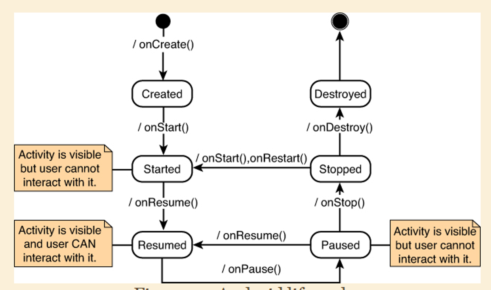
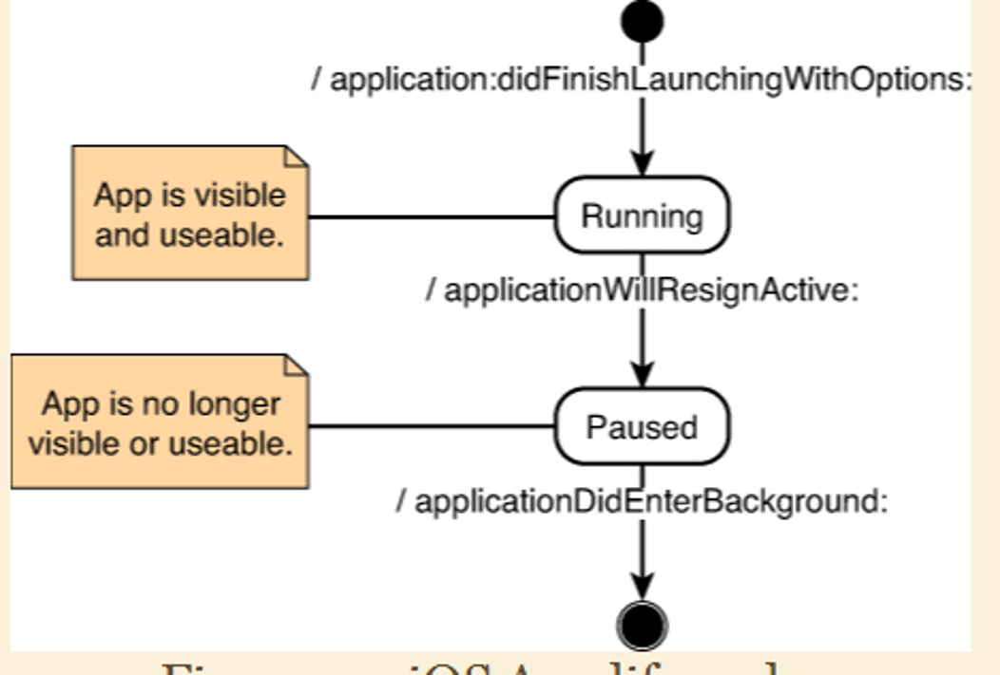
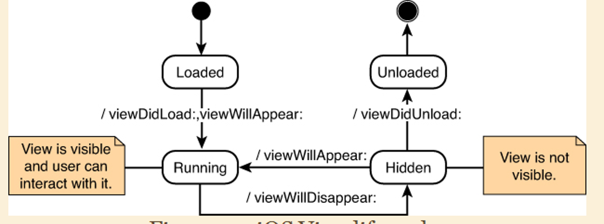

# **REKAYASA PERANGKAT APLIKASI BERGERAK**

## **CH. I. OVERVIEW OF MOBILE APP DEVELOPMENT**

#### **ASPEK MOBILITAS**

- User mobility
  > berkomunikasi **_anytime_**, **_anywhere_**, with **_anyone_**, **_anycost_**.
- Device mobility
  > terhubung **_anytime_**, **_anywhere_**.
- Data mobility
  > **_data_** flow **_anytime_**, from/to **_anywhere_**.
- Service mobility
  dapat diakses
  > **_anytime_** dan **_anywhere_**, **_any device_**.

---

#### **WHY MOBILE APPS**

##### TRANSFORMATIFE DEVICES

- platform **_mobile computing_** pertama
- sensor
- berkomunikasi dengan perangkat lain
- perangkat mobile juga komputer

##### REACHING CUSTOMERS

- terjangkau oleh pngguna
- mendukung perkembangan brand

##### CHANGING BUSINESS PROCESS

proses rekayasa bisnis lebih cepat dan akurat.

##### MAKING MONEY

- berpotensi menghasilkan uang lebih mudah.
- dev. tidak perlu memikirkan distribusi, retur, atau tagihan.
- contoh: jual-bayar sekali

---

#### HAL PENTING DALAM DESAIN APP

desain aplikasi:

- **"porting"** dari komputer ke mobile **perlu didesain ulang**.
- kemampuan **mobile != pc**.

OS mobile tidaklah multitasking. karena tetap satu aplikasi dalam satu waktu.

---

#### ANDROID LIFECYCLE

#### IOS LIFECYCLE

android hanya terdapat **_satu lifecycle_**. sedangkan iOs ada **_app lifecycle_** dan **_view lifecycle_**

**APP LIFECYCLE**

**VIEW LIFECYCLE**

---

#### UKURAN DAN ORIENTASI

- layar **_lebih kecil_** dari PC
- scrolling
  > vertical scrolling (default)
  > horizontal scrolling
- setiap langkah harus jelas tujuannya (UX)
- perlu desain sendiri untuk orientasi vertikal/horizontal

---

#### ISU KONEKTIFITAS

perangkat bisa saja diskonek (DC).

koneksi bisa sangat lambat.
apple mewajibkat warning saat DC. android tidak.

perlu dipikirkan tentang threading agar tidak memblock aktivitas user.

maka dari itu upload/download secara async.

---

#### BATERAI

kapasitas sedikit.

aplikasi boros baterai cenderung mendapat penilaian buruk

layar mengkonsumsi batterai paling banyak

disusul dengan sensor.

---

#### ISU HARDWARE

dalam hal spesifikasi, apple lebih seragam ketimbang android.

karena dev ios ekslusif untuk produk apple saja. sedangkan android dari beragam manufaktur.

akurasi komponen tergantung dari produsen.

---

#### DEVELOPMENT KEY FAKTOR

##### LINGKUP APLIKASI

tujuan dari aplikasi harus jelas. fitur-fitur didalam tidak boleh melenceng dari konsep.

##### PERFORMA

sebaiknya responsif, user oriented. dan UX harus diperhatikan.

##### DESAIN UI

bersifat intuitif dan fokus.

redesain yang mengevaluasi desain sebelumnya menghasilkan UX yang bagus.

##### INTERAKSI BERBEDA

mobile menggunakan onscreen keyboard.

gesture, swipe, tap, hold, merupakan pengganti dari mouse pada PC.

##### INTERAKSI MULTIMODAL

berbagai interaksi dengan komputer/mobile.

contohnya seperti suara, penglihatan, sentuhan.
