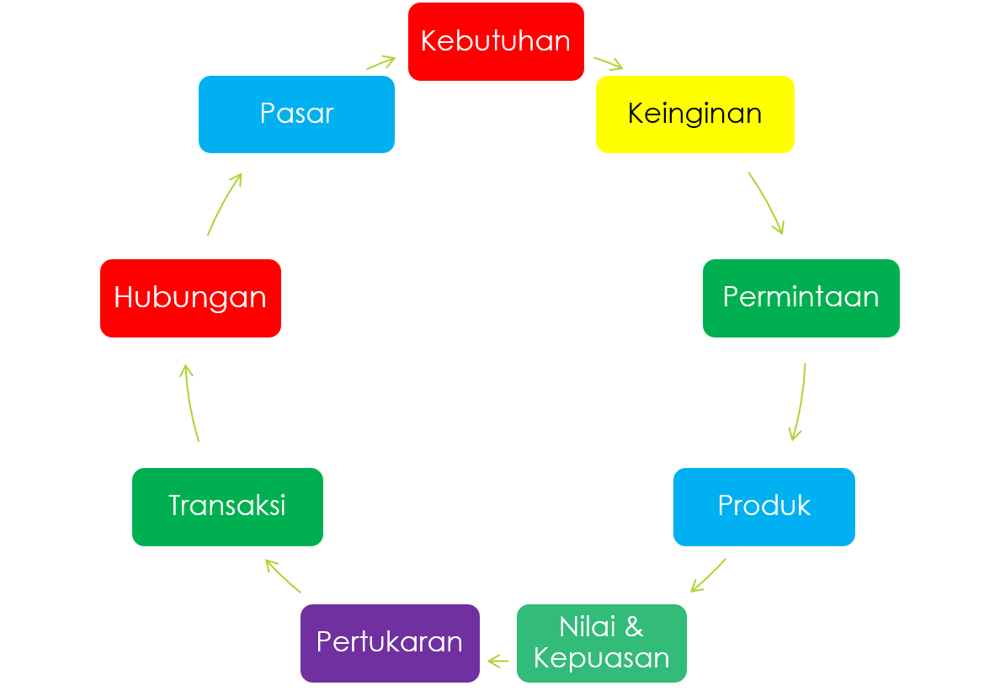
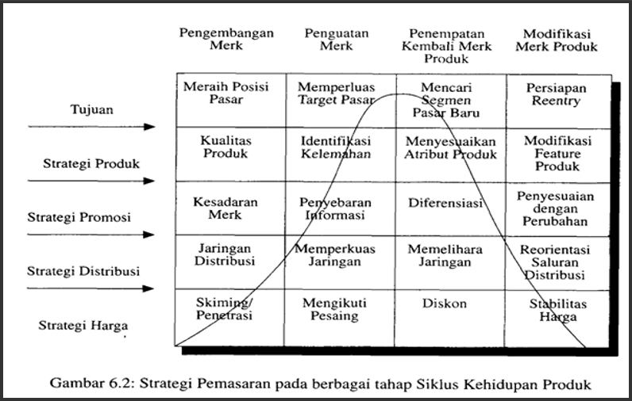

# **💰 ANALISIS BISNIS DAN STUDI KELAYAKAN BISNIS 💰**

Terdapat dua studi atau analisis yang dapat digunakan:

- Studi kelayakan usaha
- Analisis SWOT

Dari hasil studi tersebut dapat digunakan untuk:

- merintis usaha baru
- mengembangkan usaha
- memilih jenis usaha/investasi

Pihak pihak yang memerlukan dan berkepentingan:

- pihak wirausahawan: `untuk mengetahui kelayakan bisnis`
- pihak investor: `untuk mengetahui jenis investasi yang tepat`
- pihak masyarakat dan pemerintah: `sebagai bahan kajian untuk mengetahui manfaat usaha untuk masyarakat`

## **PROSES DAN TAHAPAN STUDI KELAYAKAN**

1. Tahap penemuan ide
2. Tahap formulasi tujuan (visi/misi)
3. Tahap analisis
   1. Aspek pasar
   2. Aspek teknik produksi/operasi
   3. Aspek manajemen/pengilahan
   4. Aspek finansial
4. Tahap keputusan (`Dilaksanakan/tidak`)

#### ANALISIS KELAYAKAN

1. Analisis aspek pemasaran
   - kebutuhan dan keinginan konsumen
   - segmentasi pasar
   - target
   - nilai tambah
   - masa hidup produk
   - struktur pasar
   - persaingan pasar dan strategi
   - ukuran pasar
   - pertumbuhan pasar
   - laba kotor
   - pangsa pasar
2. Analisis aspek produksi/operasi
   - lokasi operasi
   - volume operasi
   - mesin dan peralatan
   - bahan baku
   - tenaga kerja
   - tata letak
3. Analisis aspek manajemen/pengolahan
   - kepemilikan
   - organisasi
   - tim manajemen
   - karyawan
4. Analisis finansial
   - kebutuhan dana
   - sumber dana
   - proyeksi neraca
   - proyeksi laba rugi
   - proyeksi aliran kas

#### PROYEKSI ALIRAN KAS

terdapat 3 aliran kas:

- kas masuk: `penerimaan berupa hasil penjualan/pendapatan`
- kas keluar: `biaya yang dikeluarkan`
- kas masuk bersih: `selisih kas masuk dan kas keluar`

proyeksi aliran kas masuk bersih:

```
aliran_kas_masuk = laba_setelah_pajak + penyusutan + (1 - tarif_pajak) * bunga;
```

## **KRITERIA INVESTASI**

kriteria investasi untuk mengetahui layak atau tidaknya suatu investasi. terdapat beberapa metode:

- payback period
- net present value
- internal rate of return
- probability index

<br>

#### PAYBACK PERIOD

periode yang diperlukan untuk menutup kembali pengeluaran investasi. berikut adalah rumus:

```javascript
periode_pembayaran_kembali = nilai_sekarang/kas_masuk_bersih * 1 tahun
```

**misal:**
suatu perusahaan menanamkan modalnya dalam bentuk investasi 48.000.000 kemudian diperoleh keunrungan setelah pajak senilai 10.000.000 dan depresiasi sebesar 16.000.000. maka:

```
periode_pembayaran_kembali = 48.000.000 / (10.000.000 + 6.000.000) * 1 tahun
periode = 3 tahun.
```

**dengan catatan:**

- **profit** = penerimaan total tahunan - biaya tahunan yang dikeluarkan (Co + Ct)
- **Co**= biaya tetap awal
- **Ct** = biaya variable

<br>

#### NET PRESENT VALUE

untuk menghitung interest rate dan nilai bersih:

`NPV = sum(PF * Ct) - sum(PF * Bt)`

`PF = (1 + tingkat_bunga)`<sup>-1</sup>

- PF: Faktor nilai. misal. **bunga bank** yang berlaku **18%** dan perode waktu **1 thun**. maka:
  > `PF = (1 + 0.18)`<sup>-1</sup>
  >
  > `PF = 0.847`
- Bt: benefit/keuntungan
- Ct: biaya total

**Misal:** perusahaan konveksi di bandung ingin menambah mesin jahit. biaya investasi awal adalah 40jt. umur dari mesin jahit adalah 5 tahun. dari hasil durvey didapat perkiraan aliran khas sebagai berikut:

| Tahun | Ct (total) | Bt (penerimaan) |
| ----- | ---------- | --------------- |
| 0     | 40         | 0               |
| 1     | 10         | 20              |
| 2     | 15         | 25              |
| 3     | 40         | 80              |
| 4     | 20         | 60              |
| 5     | 5          | 40              |

dengan bunga = 0.18. didapati sebagai berikut:

| Tahun | PF    | Ct  | Bt  | PF x Ct | PF x Bt | NPV   |
| ----- | ----- | --- | --- | ------- | ------- | ----- |
| 0     | 1     | 40  | 0   | 40.00   | 0       | -40   |
| 1     | 0.847 | 10  | 20  | 8.47    | 16.95   | 8.48  |
| 2     | 0.718 | 15  | 25  | 10.77   | 17.95   | 7.18  |
| 3     | 0.606 | 40  | 80  | 24.34   | 46.69   | 22.35 |
| 4     | 0.515 | 20  | 60  | 10.34   | 30.95   | 20.63 |
| 5     | 0.437 | 5   | 40  | 2.19    | 17.48   | 15.29 |

**NPV** = -4 + 8.48 + 7.18 + 22.35 + 20.63 + 15.29

**NPV = 33.93**

<br>

#### COST BENEFIT RATIO

atau biaya manffaat dapat dihitung menggunakan rumus berikut:

```
---
CBR = sum(PF * Bt) / sum(PF * Ct)
---

sum(PF * Bt) = 16.95 + 17.95 + ... = 130.02
sum(PF * Ct) = 40 + 8.47 + ... = 96.09

CBR = 130.02 / 96.09 = 1.35
```

Apabila **CBR > 1**, maka akan diperoleh manfaat ekonomis.
dengan maksud **setiap Rp.1 yang diinvestasikan akan memberikan hasil sebesar Rp.1,35**.

<br>

#### INTERNAL RATE OF RETURN / IRR

> Bila **IRR > MARR**, Maka bisnis layak secara ekonomis.
>
> dimana **MARR** adalah _Minimum Attractive Rate of Return_

berikut adalah tentang penghitungan IRR:

1. IRR dapat dihitung dengan cara **coba coba memasukkan suku bunga**.
2. pada masalah diatas, dengan **interest rate 18%** didapati **NPV = 33.93jt**.
3. **cari NPV = 0**, dengan cara mencoba nilai interest rate lainnya.
4. **mengganti interest rate** menjadi **36%**. (1 - 0.36)<sup>-t</sup>
5. didapati **NPV = 7,94jt**.
6. karena **NPV masih lebih besar dari 0**. Interest rate diubah ke **40%**.
7. didapati **NPV = 3.74jt**. **tetap lebih besar**.
8. mengganti interest rate **48%**.
9. didapati **NPV = -3.909jt**. maka **NPV < 0**.

maka didapati penghitungan sebagai berikut:

| Interest | NPV        |
| -------- | ---------- |
| 18%      | 33.93 > 0  |
| 36%      | 7.94 > 0   |
| 40%      | 3.75 > 0   |
| 48%      | -3.909 < 0 |

**Maka NPV = 0 berada antara 40% dan 48%**.

kemudian kita hitung menggunakan interpolasi:

| i   | Interest | NPV    |
| --- | -------- | ------ |
| A   | 0.40     | 3.75   |
| B   | 0.48     | -3.909 |

```
IRR = interestA + ((NPVA - 0) / (NPVA - NPVB)) * (interestB - interestA)
---
IRR = 0.40 + ((3.74 - 0) / (3.74 - (-3.9))) * (0.48 - 0.40)
---
IRR = 0.4438

Bisnis layak secara ekonomis.
```

<br>
<br>

# 👨‍🎓**‍KEWIRAUSAHAAN DAN LINGKUNGAN GLOBALISASI**

#### TANTANGAN KREATIVITAS DAN INOVASI (ANCOK DKK)

- Mobilitas
  - investor dapat bebas memilih
  - teknologi memungkinkan transaksi dimana saja
- Keserempakan
  - barang/jasa tersedia dimana saja
  - produk standar global
- Terobosan
  - Hiperkompetensi
  - Deregulasi
  - Swastanisasi
  - Inovasi

yang diajukan oleh ancok adalah. mobilitas untuk kemudahan dimana saja dan kebebasan memilih. kemudian keserempakan yang berarti dimana-mana, dan terobosan.

#### TANTANGAN KREATIVITAS DAN INOVASI (STONER DKK)

- Kedekatan pada stakeholder
  - pengaruh teknologi informasi
- Lokasi
  - memperluas organisasi melalui berbagai negara
- Sikap
  - terbuka pada praktek manajemen

#### TANTANGAN KREATIVITAS DAN INOVASI LINGKUNGAN ABAD 21

1. terjadi perubahan yang cepat di penghujung milenium ke 2
2. indonesia mengalami krisis ekonomi. yang mengakibatkan:
   1. Ekonomi -> mengalami depresiasi Rupiah.
   2. Politik -> terbukanya demokrasi. dampak pada sosbudhum.
3. Perlu disikapi secara proaktif.

#### ERA KREATIVITAS DITANDAI DENGAN

1. kesementaraan
2. keanekaragaman
3. kebaruan

#### INOVASI

- yang tidak mau berubah pasti akan mengalami kemunduran.
- kesuksesan masa lalu bisa menjadi kegagaland dimasa kini.
- perusahaan perlu melakukan tinjauan ulang.
- kunci sukses perusahaan terdapat pada kemampuannya untuk merespon perubahan tersebut.

macam macam inovasi

- Inovasi produk
- Inovasi proses
- Inovasi jasa

#### ENTERPRENEURSHIP (I GEDE RAKA)

1. Inovator
2. Value creator
3. Calculated risk taker
4. Path finder
5. Resource Organizer
6. High achiever

#### ENTERPRENEUR vs INTRAPRENEURSHIP

1. Intrapreneur

   > seorang yang memiliki mimpi/ide dan mampu mewujudkannya menjadi sebuah keuntungan nyata. intrapreneur bisa saja sang **creator** atau **inventor**.

2. Enterpreneur

   > sedang enterpreneur lebih ke bagian luar dari organisasai.

3. Creative thinker

   > mempunyai kemampuan untuk menciptakan ide ide baru.

4. Inovator

   > mampu mengenalkan hal hal baru tersebut pada pasar.

5. Inventor
   > gabungan dari creative thinker dan inovator.

#### INOVASI

merupakan proses untuk menemukan atau menerapkan sesuatu yang baru pada situasi yang baru.

mengelola inovasi:

- individu memiliki ide baru
- inovasi membutuhkan tim
- tim berada pada organisasi

#### KREATIFITAS MENURUT AHLI

> creatifitas merupakan kemampuan untuk mencipta. baik gagasan maupun wawasan yang baru/fresh.

##### KREATIFITAS (GEORGE JM, ZHOU)

- inovasi dan kreatifitas berada pada domain yang sama.
- kreatifitas merupakan langkah awal dalam inovasi.
- kreatifitas berkaitan tentang pembaruan produk.
- inovasi berkaitan dengan implementasinya.

##### DEFINISI KREATIFITAS

- **PERSON** (Gilford)
  > kreatifitas merujuk pada kemampuan yang menajdi karakteristik orang kreatif.
- **PROCESS** (Munandar)
  > kreatifitas adalah proses yang berfokus pada pengaruhnya terhadap orisinalitas.
- **PRODUCT** (Baron)
  > kemampuan untuk membawa sesuatu yang baru di kehidupan.
- **PRESS** (Amabile)
  > kreatifitas dapat ditujukan sebagai kualitas yang diakui oleh pengamat yang layak.

##### CIRI CIRI SIFAT ORANG KREATIF

- **FLUENCY** - berkaitan tentang kelancaran.
- **FLEXIBILITY** - keluwesan dalam memecahkan masalah.
- **ORIGINALITY** - mempunyai gagasan asli.
- **ELABORATION** - dapat menjelaskan secara detail.
- **REDEFINITION**- perumusan kembali.

##### DO's and DONT

Do:

1. bertujuan, sistematis, dan analisis peluang.
2. inovasi yang seimbang.
3. inovasi yang efektif. sederhana dan terfokus.
4. inofasi yang efektif dimulai dari hal hal kecil.

Dont:

5. jangan mengerjakan beragam hal.
6. jangan berinovasi untuk sesuatu yang akan datang.

<br>
<br>

# 👨**‍PENYUSUNAN STRATEGI PEMASARAN**

### **TEORI PEMASARAN**

1. aliran produk dari **produsen -> pedagang -> konsumen**.
2. suatu **proses sosial**/manajerial guna **mendapatkan sesuatu yang diinginkan** dengan cara **menawarkan/menciptakan**.
3. pemasaran melibatkan banyak kegiatan yang berbeda.

### **KONSEP INTI PEMASARAN**



**Siklus dari pasar:**

1. kebutuhan
2. keinginan
3. permintaan
4. produksi
5. kepuasan
6. pertukaran
7. transaksi
8. hubungan
9. pasar
10. kebutuhan

### **TUJUAN SISTEM PEMASARAN**

1. memaksimalkan konsumsi
2. memaksimalkan utilitas konsumsi
3. memaksimalkan pilihan
4. memaksimalkan mutu hidup
5. kualitas, kuantitas, ketersediaan, harga, dan lingkungan.

### **FUNGSI PEMASARAN**

1. informasi pasar
2. standarisasi mutu
3. produk panduan pengguna

### **BIAYA PEMASARAN**

biaya pemasaran meliputi hal hal berikut ini:

- transportasi
- packing
- penyimpanan
- pemesanan
- trademark
- pajak
- resiko kerusakan

### **ANALISIS STRATEGI PEMASARAN**

STP:

- Segmentasi
- Targetting
- Positioning

MARKETING MIX:

- product
- price
- place
- promotion

#### SEGMENTASI PASAR

- Segmentasi Geografik
  > Seperti negara, regional, kota, kecamatan.
- Segmentasi Demografi
  > umur, jenis kelamin, pendapatan.
- Segmentasi Psikografik
  > kelas sosial, gaya hidup, kepribadian.
- Segmentasi Tingkah laku
  > kesempatan, manfaat yang dicari, status pengguna, tingkat pemakaian.

#### TARGETTING

> kelompok konsumen yang mempunyai ciri-ciri atau sifat hampir sama (homogen) yang dipilih perusahaan dan yang akan dicapai dengan strategi bauran pemasaran.

manfaat targetting:

- mengembangkan posisi produk
- memudahkan penyesuaian produk di pasar
- membidik peluang pasar lebih luas
- memanfaatkan sumber daya perusahaan dengan efektif dan efissien
- mengantisipasi persaingan

### **MARKETING MIX**

PRODUCT:

- keragaman
- kualitas
- desain
- ciri
- nama
- kemasan
- ukuran
- pelayanan
- garansi

PRICE:

- daftar harga
- diskon
- potongan harga khusus
- periode pembayaran
- syarat kredit

PLACE:

- saluran pemasaran
- cakupan pemasaran
- pengelompokan dan lokasi
- persediaan
- transportasi

PROMOTION:

- promosi penjualan
- periklanan
- tenaga penjualan
- humas
- pemasaran langsung

### **PRODUCT LIFE CYCLE**


