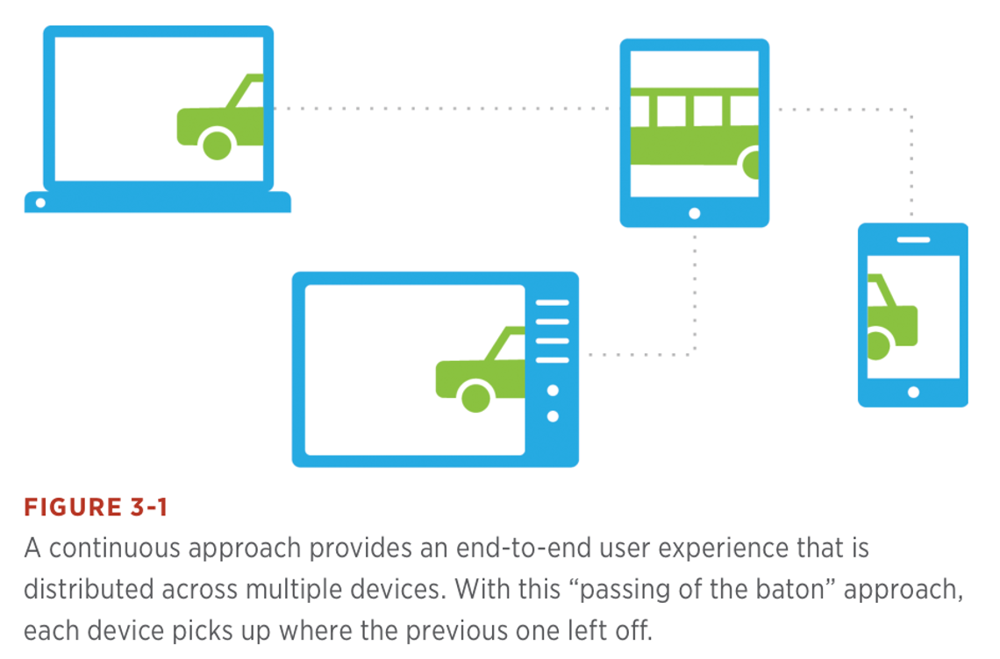
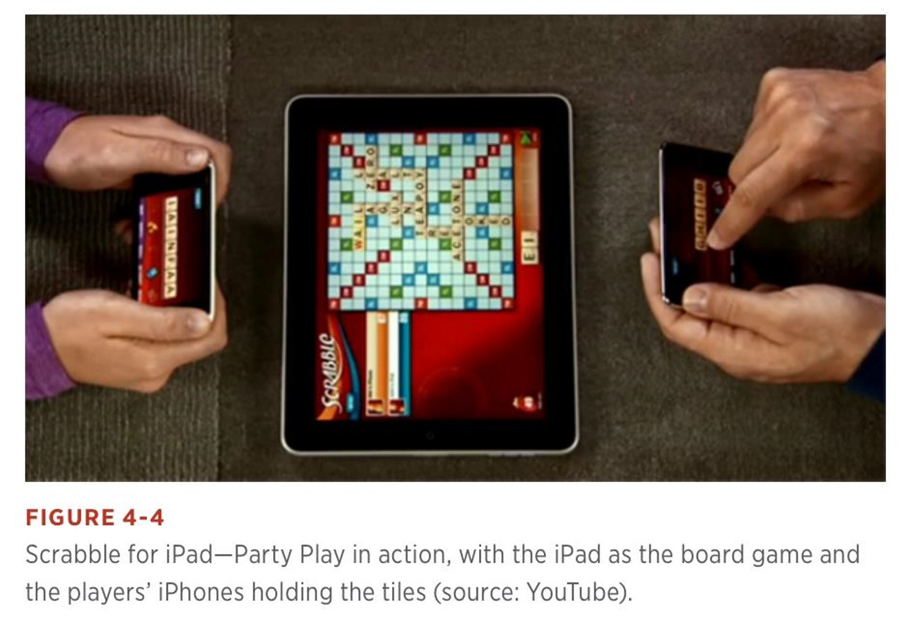
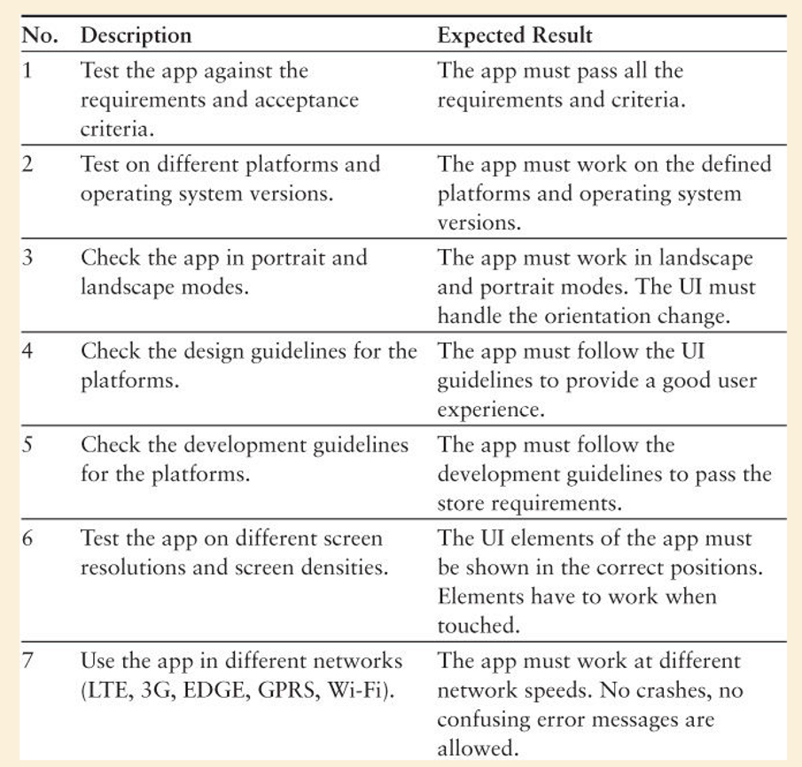

## TABLE OF CONTENT

# 📱**MULTI DEVICE EXPERIENCE**

kita hidup di era multi device experience

lebih banyak berinteraksi dengan device

## **PENDEKATAN**

- Everything
- Everywhere
- Anytime

Context-driven experience:

- Right things
- Right place
- Right time

## **3Cs FRAMEWORK**

- Consistency : konsisten 👍
- Continuous : kontinyu ✔️
- Complementary : komplemen 🤝

#### CONSISTENT DESIGN APPROACH

- Konten yang sama disajikan pada device yang berbeda dan disesuaikan dengan karakteristik masing masing devices sehingga tampilan tetap konsistent 😄.

- Konsisten bukan berarti sama persis 🙁.
- Menawarkan experience yang sama di platform yang berbeda 👍.

#### CONTINUOUS DESIGN APPROACH

terdapat dua tipe experience:

- single activity flow
- sequenced activity flow

#### COMPLEMENTARY DESIGN APPROACH

- mengenalkan experience baru secara multi devices.
- dimana perangkat melengkapi satu sama lain.
- dengan artian, full experience didapatkan jika menggunakan beberapa device secara bersamaan.

macam macam relasi dalam complementary:

- kolaborasi 🤝
  - setiap device memiliki perannya masing masing.
  - misal: scrabble, hanphone sebagai tiles, dan ipad sebagar papan.
- kontrol ☝️
  - satu device sebagai experience utama. dan devices lainnya sebagai kontrol.

 
 

# 🔧**MOBILE TESTING**

## MANUAL VS AUTOMATED TEST

- gunakan manual ketika:

  - aplikasi sangat sederhana
  - aplikasi memiliki sedikit fungsional
  - tersedia dalam waktu terbatas di appstore

- sebaliknya gunakan automated testing 🤖

## TRADITIONAL TESTING

- Static testing
  - Review
  - Static analysis
- Dynamic testing
  - Whitebox
  - Blackbox

## JAVA STATIC TOOL ANALYSIS

- Checkstyle
- Findbugs
- Lint
- PMD

#### JAVA WHITEBOX TESTING

- Junit
- TestNG

## WHITEBOX TESTING

- Statement coverage
- Path coverage
- Branch coverage
- Control flow testing
- Data flow testing

## BLACBOX TESTING

- Tanpa mengetahui struktur, class, dan method.
- Test:
  - Boundary values
  - Decision Tables
  - Equivalence class partitioning
  - Cause-effect graph
  - Error guessing
  - State transition analysis
  - All-pairs testing
  - Exploratory testing
  - etc

## MOBILE SPECIFIC TESTING

- Functional
- Usability
- Accessibility
- Battery Usage
- Stress Interrupt
- Performance
- Standby
- Installation
- Update
- Database
- Local Storage
- Security
- Platform Guideline
- Conformance

## REMINDERS

1. Checklist
2. Mnemonics
3. Mind Maps

#### CHECKLIST

#### MNEMONICS

- SFDPOT (“San Francisco Depot”)
- FCCCUTSVIDS
- ISLICEDUPFUN
